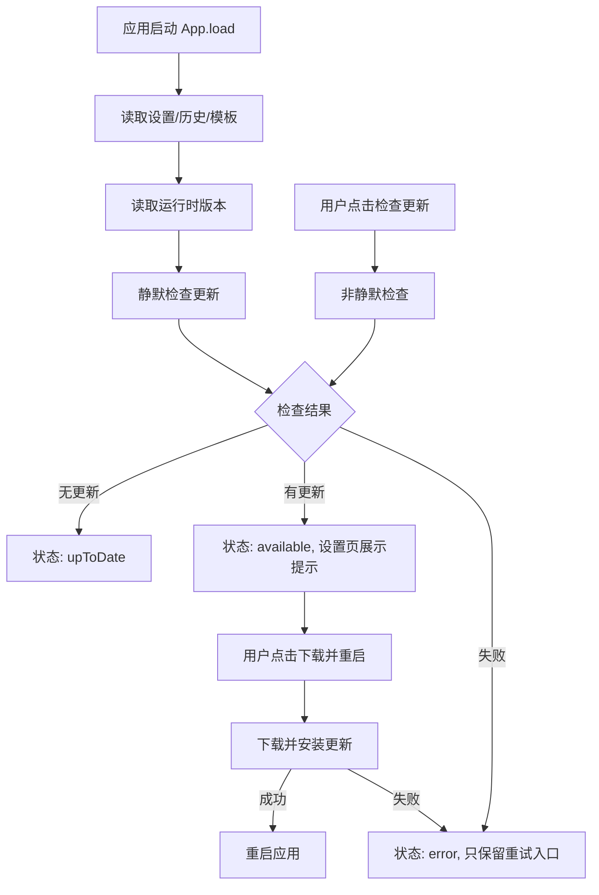

# app-update design

## 0. 术语约定

- **应用版本**：当前已安装 PixAI 的运行时版本，优先来自 Tauri `getVersion()`，不再使用 UI 里的手写版本号。grep 结论：`package.json` / `src-tauri/Cargo.toml` / `src-tauri/tauri.conf.json` 已是 `0.0.2`，`MainLayout.tsx` 仍有 `v0.1.0` 写死，需要统一。
- **更新检查**：询问发布源是否存在比当前应用版本更新的安装包。grep 结论：仓库内没有 `tauri-plugin-updater`、`plugin-updater` 或 updater 配置。
- **可用更新**：更新检查返回的新版本、说明和安装动作。它不是本地偏好，也不应写入现有 `AppPreferences`。
- **发布源**：Tauri updater 使用的远端 endpoint。现状没有 `.github` workflow 或自建发布清单，本 feature 只接入可配置发布源协议，不把具体服务器地址硬编码进业务逻辑。

## 1. 决策与约束

**需求摘要**：用户打开 PixAI 后自动检查一次更新；用户也能在设置页手动点“检查更新”。如果发现新版本，设置页展示当前版本、可用版本、更新摘要和下载 / 重启安装入口。成功标准是用户能知道当前是否最新，能看到失败原因并能重试，能在确认后进入安装重启流程。

**明确不做**：

- 不做强制更新。
- 不做静默安装或后台无感替换。
- 不做多渠道切换、灰度发布或测试版选择。
- 不做自建发布后台。
- 不把发布源 URL、签名公钥或版本号散落写死在 React 组件里。

**复杂度档位**：

- 健壮性 = L3 严防（偏离内部工具默认 L2；更新会下载并替换应用包，失败路径必须可见且不能让主流程崩掉）。
- 结构 = modules（偏离内部工具默认 functions；需要隔离 Tauri updater 适配、store 状态和设置 UI）。
- 安全性 = validated（偏离 trusted；发布源、签名公钥、更新包验证走 Tauri updater 配置，不接受任意用户输入 URL）。
- 兼容性 = current-only（当前只覆盖现有 Windows 桌面包；不扩展到旧 Electron 数据迁移或跨渠道升级）。

**关键决策**：

1. 使用 Tauri v2 updater 插件作为更新执行层，而不是手写下载 exe/msi 后运行。这样名词层会是 `UpdateInfo` / `UpdateStatus` 包装 Tauri updater，而不是“下载链接 + 本地文件路径 + 手动启动安装器”的自建协议。
2. 更新状态放在前端 store 的独立 slice，不写入 `AppPreferences`。更新状态是运行时瞬态信息；偏好只保留用户设置。启动自动检查由 `load()` 后触发一次，避免设置页未打开时也能得到结果。
3. 设置页新增“关于应用 / 更新”区块，但复杂逻辑拆成子组件。`SettingsPanel.tsx` 已 687 行，不能继续把完整更新 UI、按钮状态和文案都塞进去。
4. 发布源配置放在发布环境的 Tauri 配置和构建文档中，仓库默认不写空 endpoint / public key / artifact 生成开关。业务代码只调用 `pixaiApi.appUpdate`，未配置时把 updater 错误展示为可重试状态。
5. “下载并重启”由用户点击触发；下载失败停在可重试状态，下载成功后按 updater 的安装/重启能力执行，不替用户悄悄重启。

**前置依赖**：

- 发布包需要补齐 Tauri updater 的 endpoint、artifact 与签名配置。没有有效 endpoint / public key 时，运行时应显示“更新源未配置或检查失败”，而不是影响生图工作台；本地 debug build 不要求签名密钥。

## 2. 名词与编排

### 2.1 名词层

**现状**：

- `src/shared/types.ts` 已有 `AppPreferences`、`CodexSkillStatus` 等应用级类型，但没有应用版本或更新状态类型。
- `src/services/app-api.ts` 是前端服务聚合入口，当前聚合 settings / preferences / image / prompt / codexSkill / shell，没有 `app` 或 `appUpdate` 域。
- `src/store/app-store.ts` 维护全局 UI 与业务状态，已有 `codexSkillStatus` / `codexSkillInstalling` 这种设置页用的瞬态状态。
- `src/components/settings/SettingsPanel.tsx` 直接渲染所有设置区块，当前没有“关于应用 / 更新”区块。
- `src/components/layout/MainLayout.tsx` 侧边栏版本号写死为 `v0.1.0`，和 `package.json` / Tauri 配置的 `0.0.2` 不一致。
- `src-tauri/Cargo.toml` 未接入 updater 插件；`src-tauri/capabilities/default.json` 权限只有 core/dialog/notification/opener；`tauri.conf.json` 没有发布用 updater 配置。

**变化**：

- 新增运行时类型：
  - `AppVersionInfo`：当前版本、平台/运行模式、可选构建信息。
  - `AppUpdateState`：`idle | checking | upToDate | available | downloading | downloaded | installing | error` 加 `currentVersion`、`availableUpdate`、`lastCheckedAt`、`errorMessage`。
  - `AvailableAppUpdate`：版本、发布日期、说明、原始 body、是否可安装。
- 新增 `pixaiApi.appUpdate` 服务域，封装：
  - `getVersionInfo()`
  - `check()`
  - `downloadAndInstall()`
  - `relaunch()` 或 updater 安装后的重启入口
- `useAppStore` 新增 `appUpdate` 状态和动作：
  - `loadAppVersionInfo()`
  - `checkForAppUpdate(options?: { silent?: boolean })`
  - `downloadAndInstallAppUpdate()`
- `SettingsPanel` 引入独立 `AppUpdateSection` 子组件，只消费 store 状态和动作。
- `MainLayout` 侧边栏版本展示改为 store 中的运行时版本；不可用时降级为 `v0.0.0` 或短暂占位。
- Tauri 层新增 updater / process 相关插件和 capability 权限；`tauri.conf.json` 保持本地构建可用，README 记录发布时需要补的 updater endpoints / public key / artifact 生成配置。

**接口示例**：

```ts
// 来源：src/shared/types.ts AppUpdateState
type AppUpdateState = {
  status: 'idle' | 'checking' | 'upToDate' | 'available' | 'downloading' | 'downloaded' | 'installing' | 'error'
  currentVersion: string
  availableUpdate: AvailableAppUpdate | null
  lastCheckedAt: string | null
  errorMessage: string | null
}
```

```ts
// 来源：src/services/app-api.ts pixaiApi.appUpdate
await pixaiApi.appUpdate.check()
// 无更新 -> { currentVersion: '0.0.2', update: null }
// 有更新 -> { currentVersion: '0.0.2', update: { version: '0.0.3', notes: '...', date: '2026-05-24' } }
// 更新源不可用 -> throw Error('检查更新失败：...')
```

```tsx
// 来源：src/components/settings/AppUpdateSection.tsx
<AppUpdateSection
  state={appUpdate}
  onCheck={() => checkForAppUpdate({ silent: false })}
  onInstall={() => downloadAndInstallAppUpdate()}
/>
```

### 2.2 编排层



**现状**：

- `App.tsx` 启动时只调用 `load()`；`load()` 并行读取 settings/preferences，随后读取 conversation/runs/history/templates。
- `SettingsPanel.tsx` 打开时会读取 Codex 技能安装状态；这是设置页局部状态刷新。
- `pixaiApi` 所有前端服务调用已经集中在 `src/services/app-api.ts`；Tauri 命令封装集中在 `src/lib/platform.ts`。
- 错误提示主要通过 `useAppStore.notify()` 的 toast 展示，不阻塞主界面。

**变化**：

- `load()` 完成基础数据后触发版本读取；Tauri 环境下再触发一次静默更新检查。静默检查失败只更新 `appUpdate.errorMessage`，不弹全局 toast，避免启动噪音。
- 设置页 `AppUpdateSection` 根据 `appUpdate.status` 渲染：
  - `idle/checking`：显示当前版本和检查中状态。
  - `upToDate`：显示当前已是最新和最近检查时间。
  - `available`：显示新版本、说明、下载并重启按钮。
  - `downloading/installing`：按钮禁用并显示进度语义；若 updater 暴露进度，后续可填百分比。
  - `error`：显示失败原因和“重新检查”。
- 手动检查走同一个 `checkForAppUpdate({ silent: false })`，失败时同时 toast “检查更新失败：...”。
- 下载并安装只允许在 `availableUpdate` 存在时触发；并发点击直接忽略。
- 非 Tauri / dev 浏览器环境下 `pixaiApi.appUpdate.check()` 返回“更新能力仅桌面端可用”的受控错误或 disabled 状态，UI 不展示误导性安装按钮。

**流程级约束**：

- 错误语义：检查失败不影响生图、历史、设置保存；下载/安装失败保留可重试状态。
- 幂等性：启动自动检查每次应用生命周期只跑一次；手动检查可重复，但同一时间只允许一个检查请求。
- 并发约束：`checking/downloading/installing` 时按钮禁用，避免多个 updater 实例同时操作安装包。
- 可观测点：记录 `lastCheckedAt`、`errorMessage`，toast 只用于用户主动动作或发现可用更新后的轻提示。
- 扩展点：未来渠道、自动检查开关或发布源切换都挂在 `appUpdate` 服务域，不修改图片生成或 Codex Bridge 流程。

### 2.3 挂载点清单

- Tauri 插件注册：`src-tauri/src/lib.rs` / `Cargo.toml` — 新增 updater 与必要的重启能力。
- 发布配置：`README.md` / 发布环境 `src-tauri/tauri.conf.json` — 记录并在发布时新增 updater endpoints、public key、artifact 生成配置。
- Capability 权限：`src-tauri/capabilities/default.json` — 新增 updater / process 所需权限。
- 全局 store 启动流程：`useAppStore.load()` — 新增应用生命周期内的自动检查入口。
- 设置页公共 UI 注入点：设置面板新增“关于应用 / 更新”区块。
- 侧边栏版本展示：`MainLayout` 版本线改为运行时版本。

### 2.4 推进策略

1. 桌面更新底座：接入 Tauri updater 插件和权限，先让桌面端能编译通过。
   退出信号：`pnpm tauri build --debug` 或 Rust check 能识别插件配置，不因权限缺失失败。
2. 前端平台适配：封装版本读取、检查更新、下载安装和重启入口。
   退出信号：浏览器环境有受控兜底，Tauri 环境调用路径集中在一个适配模块。
3. store 编排骨架：新增 `appUpdate` 状态和三个动作，启动时自动静默检查一次。
   退出信号：单测可观察到状态从 idle/checking 到 upToDate/available/error。
4. 设置页静态结构：新增 `AppUpdateSection`，覆盖无更新、有更新、失败、下载中状态。
   退出信号：组件在现有设置栏宽度内不溢出，按钮状态清晰。
5. 真实状态接入：把设置页和侧边栏接入 store 版本与更新状态。
   退出信号：启动后侧边栏版本与 Tauri/package 版本一致，手动检查能更新区块状态。
6. 验证与文档：补测试、更新 README 的发布 / updater 配置说明。
   退出信号：`pnpm check` 通过，发布说明能指导生成 updater artifact。

### 2.5 结构健康度与微重构

##### 评估

- 文件级 — `src/components/settings/SettingsPanel.tsx`：687 行，已混合通知、服务配置、Codex 技能、会话参数、供应商编辑弹窗；继续追加完整更新区块会增加职责和滚动负担。
- 文件级 — `src/store/app-store.ts`：668 行，已经承载全局状态和动作；新增少量 update slice 可接受，但复杂计算应放服务/平台适配层。
- 文件级 — `src/App.tsx`：108 行，启动 hook 较集中；不直接塞 updater 细节，只通过 store 动作触发。
- 文件级 — `src/components/layout/MainLayout.tsx`：127 行，只需要替换版本来源，改动密度低。
- 目录级 — `src/components/settings/`：当前只有 `SettingsPanel.tsx` 一个文件，本次新增 `AppUpdateSection.tsx` 不构成目录摊平。
- 目录级 — `src/services/`：已有多个服务文件，本次新增 `app-update.ts` 属于现有服务分层延伸；命名模式清晰。
- compound convention 检索：`.codestable/compound` 为空，没有可用的目录组织 / 命名约定。

##### 结论：不做微重构

本次不做“只搬不改行为”的微重构，但要求新更新 UI 落到独立 `AppUpdateSection`，新 updater 逻辑落到服务/平台适配模块。`SettingsPanel.tsx` 的整体拆分已经超出本 feature 范围，因为会牵涉现有多个设置区块的组件边界重划。

##### 超出范围的观察

- `src/components/settings/SettingsPanel.tsx` 已经偏胖，后续建议走 `cs-refactor` 拆分通知、服务配置、会话参数和供应商弹窗。本 feature 只新增独立更新区块，不重排已有设置结构。

## 3. 验收契约

**关键场景清单**：

- 启动应用且发布源可达、无新版本 → 设置页显示当前版本和“当前已是最新”，工作台正常可用。
- 启动应用且存在新版本 → 设置页“关于应用 / 更新”区块显示当前版本、可用版本、更新说明和“下载并重启”入口。
- 用户点击“检查更新”且检查成功 → 按钮进入检查中再恢复，区块展示最新检查结果和最近检查时间。
- 用户点击“检查更新”且网络失败 / 发布源不可达 → 区块展示失败原因和重新检查入口，工作台不崩溃。
- 用户点击“下载并重启” → 下载/安装期间按钮不可重复点击；失败时展示可重试错误；成功时进入重启安装流程。
- 浏览器 dev 环境或 updater 未配置 → 设置页不出现误导性的可安装更新；手动检查返回受控提示。
- 侧边栏版本展示 → 不再显示 `v0.1.0`，而是运行时当前版本。

**明确不做的反向核对项**：

- 代码中不应出现强制更新分支或阻止用户继续使用旧版本的判断。
- 代码中不应在启动时自动调用下载 / 安装 / 重启。
- React 组件中不应硬编码发布源 URL 或 updater public key。
- 不应新增渠道选择、灰度策略或测试版开关。
- 不应改动图片生成、提示词助手、历史图库的业务流程。

## 4. 与项目级架构文档的关系

acceptance 阶段应把“应用更新”补进 `.codestable/architecture/ARCHITECTURE.md`：

- 核心概念：应用版本、更新检查、可用更新。
- 模块索引：Tauri updater 插件、前端 `appUpdate` 服务域、store update slice、设置页更新区块。
- 关键约束：不强制更新、不静默安装、发布源和签名配置属于 Tauri 配置/发布流程，不散落在 UI 组件。

当前架构总入口仍是骨架，没有更细模块文档；本 feature 不要求新增子系统文档，但 acceptance 可以视实现规模决定是否补 `architecture/app-update.md`。
