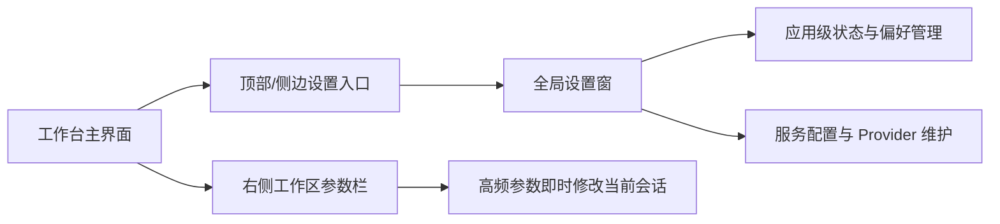

# settings-panel-redesign design

## 0. 术语约定

- **工作区参数栏**：工作台右侧、服务于“当前这次生成”的高频参数编辑区。grep 结论：当前对应 [`SettingsPanel.tsx`](E:/MyWork/PixAI-Tauri/src/components/settings/SettingsPanel.tsx) 中的“当前会话参数”以及部分模型选择。
- **全局设置窗**：服务于应用级偏好、系统状态和环境配置的低频设置层。现状代码中不存在单独的设置窗，相关内容和工作区参数混排在同一右侧栏。
- **服务配置**：Provider 的增删改查，包括接口地址、密钥、默认模型和用途。现状既有内联表单，也有供应商编辑弹窗。
- **状态卡**：更新、通知权限、技能安装这类“以状态为主而非输入为主”的展示单元。现状它们与普通表单同级排布，视觉噪音较高。

## 1. 决策与约束

**需求摘要**：当前配置界面项目过多、节奏混乱，需要先做一次前端信息架构重构设计，让用户能明显分辨“现在这次生成要调什么”和“整个应用平时怎么配置”。成功标准是：右侧高频参数区更聚焦，全局低频设置脱离工作区侧栏，Provider 配置不再像一段堆叠表单，更新/通知/技能安装这类状态信息不再干扰主工作流。

**明确不做**：

- 不在本轮直接改主应用逻辑或替换现有设置页实现。
- 不新增新的业务配置项，只重组信息架构与交互层次。
- 不把高频生成参数藏到多级深层路径里。
- 不做营销风、首屏海报式设置界面。
- 不改动图片生成、历史图库、提示词助手本身的数据语义。

**复杂度档位**：

- 走桌面工作台 UI 重构默认档位，无偏离。

**关键决策**：

1. 把现有右侧 `SettingsPanel` 拆成两层：工作台右侧保留高频“工作区参数栏”，低频应用配置改为单独的“全局设置窗”。
2. 侧栏只保留当前会话和本次生成真正常改的参数；通知、更新、技能安装、Provider 维护迁出到全局设置窗。
3. Provider 不再用“几组 select + 几个 input + 一个保存按钮”的平铺方式呈现，而改成“默认选择摘要 + Provider 管理列表/详情”的结构。
4. 更新、通知权限、技能安装统一按“状态卡”处理，不与表单字段共用同一种视觉节奏。
5. 先做静态预览和设计稿，用户批注后再进入实现阶段，避免直接重构胖文件走偏。

## 2. 名词与编排

### 2.1 名词层

**现状**：

- [`MainLayout.tsx`](E:/MyWork/PixAI-Tauri/src/components/layout/MainLayout.tsx) 用 `settingsVisible` 决定是否显示右侧设置区，但这个设置区目前既承载会话参数，也承载全局应用配置。
- [`SettingsPanel.tsx`](E:/MyWork/PixAI-Tauri/src/components/settings/SettingsPanel.tsx) 同时承担五类职责：
  - 通知与托盘偏好
  - Provider 选择和编辑入口
  - Codex 技能安装状态
  - 应用更新状态
  - 当前会话生成参数
- `profileDraft` 模态框属于服务配置的二级编辑，但入口和上下文仍嵌在大杂烩侧栏里。
- `appUpdate`、`codexSkillStatus`、`preferences` 是应用级状态，但 UI 归属上与 conversation 参数并列，缺少作用域边界。

**变化**：

- 新的 UI 名词分为两个主容器：
  - `WorkspaceConfigPanel`：右侧高频参数栏，只面向当前会话。
  - `GlobalSettingsModal`：全局设置窗，面向应用级配置与状态。
- `WorkspaceConfigPanel` 内再细分为：
  - `EngineSection`：图片模型 / 提示词模型摘要与快捷切换
  - `BasicGenerationSection`：比例、分辨率、质量、数量
  - `AdvancedGenerationSection`：低频高级参数折叠区
  - `SessionBehaviorSection`：自动写入历史、失败详情保留
- `GlobalSettingsModal` 内按左侧导航分为：
  - `GeneralTab`：托盘行为、应用更新
  - `NotificationTab`：通知开关、权限状态
  - `ServicesTab`：Provider 管理、默认 provider 选择、编辑入口
  - `ExtensionsTab`：Codex 技能安装与目录操作
- Provider 编辑继续允许使用独立详情层，但归属于 `ServicesTab` 内部流程，不再悬浮在工作区参数上下文之上。

**接口示例**：

```tsx
// 来源：src/components/settings/SettingsPanel.tsx（目标拆分）
<WorkspaceConfigPanel
  conversation={conversation}
  selectedImageProfile={imageSelectedProfile}
  selectedPromptProfile={promptSelectedProfile}
  imageModel={imageModel}
  promptModel={promptModel}
  onConversationChange={updateActiveConversation}
  onOpenGlobalSettings={() => setGlobalSettingsOpen(true)}
/>
```

```tsx
// 新的应用级设置层
<GlobalSettingsModal
  open={globalSettingsOpen}
  preferences={preferences}
  appUpdate={appUpdate}
  codexSkillStatus={codexSkillStatus}
  profiles={profiles}
  selectedImageProfileId={settings.selectedImageProfileId}
  selectedPromptProfileId={settings.selectedPromptProfileId}
  onClose={() => setGlobalSettingsOpen(false)}
/>
```

### 2.2 编排层



**现状**：

- `view === 'workspace' && settingsVisible` 时，工作区右侧始终展示一个大一统侧栏。
- 用户在一个面板中同时完成两种完全不同的任务：
  - 调本次生成参数
  - 配置整个应用环境
- 状态型组件、表单型组件、模态型子流程共处一列，导致阅读顺序不稳定。

**变化**：

- 工作区主流程改为：
  1. 用户在右侧参数栏快速调整本次生成参数。
  2. 当需要改通知、更新、Provider、技能安装等低频项时，显式打开全局设置窗。
  3. 在全局设置窗中通过左侧导航切换主题分区，而不是在工作流侧栏里上下滚动寻找。
- Provider 选择在工作区只保留“结果摘要”和必要快捷切换；Provider 的创建/编辑/删除编排移入 `ServicesTab`。
- 全局设置窗中的状态卡遵循：
  - 正常状态低噪音展示
  - 需要动作时提升视觉优先级，例如有更新时突出下载入口
- 高级生成参数采用渐进展开，默认折叠，避免初始噪音。

**流程级约束**：

- 高频参数不能多于一层点击才能触达。
- 打开全局设置窗不应打断当前工作区会话上下文，也不应清空正在编辑的 prompt。
- Provider 编辑必须保留现有能力：新增、编辑、删除、选择默认 image/prompt provider。
- 更新、通知权限、技能安装这些状态项必须支持“只看状态不改配置”的阅读路径。

### 2.3 挂载点清单

- 工作台右侧配置区：`src/components/settings/SettingsPanel.tsx` 或其后续拆分文件 — 修改
- 主布局设置入口：`src/components/layout/MainLayout.tsx` — 修改
- 应用主层模态挂载：`src/App.tsx` 或工作台布局层 — 新增
- 全局设置状态分区：`preferences` / `appUpdate` / `codexSkillStatus` / provider settings 的消费层 — 修改

### 2.4 推进策略

1. 结构拆层：先把“工作区参数”和“全局设置”在组件边界上拆开，保持静态结构可见。
   退出信号：工作区右侧只剩高频参数骨架，全局设置窗可独立打开。
2. 工作区参数栏重排：梳理引擎、基础参数、高级参数、会话选项的视觉顺序。
   退出信号：高频参数无需滚动过长即可完成一次常规配置。
3. 全局设置窗分区：完成 General / Notifications / Services / Extensions 四个分区骨架与导航切换。
   退出信号：全局应用设置能按分类访问，不再依赖长滚动。
4. Provider 管理重构：把默认 provider 选择和 provider 维护拆成摘要 + 详情流程。
   退出信号：用户能区分“本次用谁”和“维护有哪些 provider”。
5. 状态卡与细节收尾：更新、通知、技能安装统一成状态卡表达，补齐移动/窄宽度下的视觉稳定性。
   退出信号：状态型配置不再与普通表单产生同级噪音。

### 2.5 结构健康度与微重构

##### 评估

- 文件级 — [`SettingsPanel.tsx`](E:/MyWork/PixAI-Tauri/src/components/settings/SettingsPanel.tsx)：单文件职责过多，包含应用级设置、会话级参数、Provider 编辑流程和弹窗状态，已经明显超过单一职责。
- 文件级 — [`MainLayout.tsx`](E:/MyWork/PixAI-Tauri/src/components/layout/MainLayout.tsx)：行数不大，但当前“设置”只等价于右侧栏显隐，若新增全局设置层，需要重新定义入口语义。
- 目录级 — `src/components/settings/`：目前文件数量少，但 `SettingsPanel.tsx` 胖文件已成为收纳筐；后续新增全局设置窗、tab、状态卡，继续堆进一个文件会恶化。
- compound convention 检索：`.codestable/compound/` 暂无相关目录组织或设置页约定。

##### 结论：微重构（拆文件）

##### 方案

- 搬什么：将 `SettingsPanel.tsx` 中的工作区参数区、全局状态区、Provider 管理流程拆为多个子组件。
- 搬到哪：
  - `src/components/settings/workspace/`：工作区参数栏相关组件
  - `src/components/settings/global/`：全局设置窗及其 tabs
  - `src/components/settings/providers/`：Provider 管理与编辑详情
- 行为不变怎么验证：`pnpm check` 通过，已有 store 行为测试通过，工作区生成与 Provider 配置的用户路径保持可用。
- 步骤序列（provable refactor）：
  1. 先拆静态子组件骨架，不改 store 契约。
  2. 再迁移事件与状态连接。
  3. 最后把旧大面板残余逻辑清理掉。

##### 建议沉淀的 convention

- 是否稳定模式：稳定模式。
- 规则一句话：工作区高频参数组件与应用级全局设置组件分目录维护，不再混放进同一个胖面板文件。
- 适用范围：本仓库 frontend 设置与控制面板模块。
  → 建议 implement 跑通后走 `cs-decide` 归档为 `category: convention`。

## 3. 验收契约

**关键场景清单**：

- 用户在工作台调整比例、分辨率、质量、数量时，不需要穿过通知/更新/技能安装内容。
- 用户要改托盘行为、通知权限或检查更新时，通过全局设置窗进入，不影响当前会话参数阅读。
- 用户查看服务配置时，能先看到当前默认 image/prompt provider 摘要，再进入维护列表，不会一进来就是一大段表单。
- 用户初次打开工作区参数栏时，高频参数默认可见，高级参数默认折叠但可展开。
- 应用更新、通知权限、技能安装在全局设置中以状态卡或摘要单元展示，视觉噪音低于当前平铺表单。
- 全局设置窗内切换 tab 时，当前会话不会丢失，工作区仍保持原上下文。

**明确不做的反向核对项**：

- 右侧工作区参数栏中不应继续同时出现通知、更新、Codex 技能安装三个应用级区块。
- 本轮设计稿与预览中不应新增新的业务配置字段。
- Provider 维护不应被完全藏到不可发现的深层入口里。
- 不应把高频生成参数全部放进二级弹窗或多级标签页。

## 4. 与项目级架构文档的关系

acceptance 阶段应把“工作区参数层”和“全局设置层”的职责边界补进架构文档：

- 名词：工作区参数栏、全局设置窗、Provider 管理流。
- 动词骨架：工作台高频参数编辑与应用级低频配置的双层编排。
- 流程级约束：高频参数常驻、低频配置迁出、状态卡与表单的分离原则。

当前改动主要是前端交互与组件结构重组，若实现阶段组件拆分明显，可在 `.codestable/architecture/` 为设置系统补一份 UI 模块文档。
