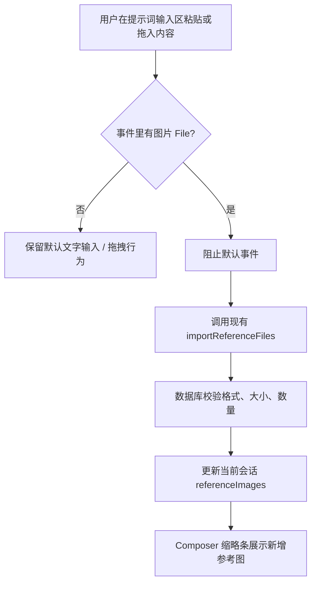

# Reference Image Input Design

## 0. 术语约定

- **输入区**：指 `Composer` 中承载提示词编辑的主 `Textarea` 和外层 prompt box。代码里已有 `prompt-box` / `prompt-textarea` 命名，本 feature 沿用，不新造“图片输入框”概念。
- **参考图**：沿用 `ReferenceImage` 类型和 `conversation.referenceImages` 会话字段。`rg` 显示该术语已经覆盖架构、store、数据库和服务层，本 feature 不新增平行实体。
- **粘贴图片 / 拖入图片**：仅指浏览器事件中可读取到的本地图片 `File`，包括 clipboard item 和 drag data transfer files，不包含远程图片 URL。

## 1. 决策与约束

**需求摘要**：为工作台创作者增强参考图入口。用户在提示词输入区粘贴或拖入 PNG/JPEG/WEBP 图片时，图片自动追加到当前会话参考图；文字粘贴仍写入 prompt；成功标准是缩略条立刻出现新增参考图，生成模式随现有逻辑变为图生图。

**明确不做**：

- 不从远程 URL、HTML `` 或富文本内容下载图片。
- 不新增参考图数据模型、数量上限或大小限制。
- 不改变现有上传按钮、历史图转参考图、生成请求组装语义。
- 不在 prompt 文本里插入图片占位符。

**复杂度档位**：走桌面工作台前端增强默认档位，无偏离。能力只扩展现有 `Composer` 输入事件，不引入新后端 API、外部 SDK 或并发任务。

**关键决策**：

- 图片导入复用 `importReferenceFiles(files)`，让 `AppDatabase.importReferenceImages` 继续统一处理 8 张上限、20MB 单图上限和格式校验。
- 粘贴事件只在发现图片文件时拦截；没有图片时不阻止浏览器默认文字粘贴。
- 拖入输入区与拖入参考图按钮行为一致，统一进入追加参考图路径。

## 2. 名词与编排

### 2.1 名词层

**现状**：

- `ReferenceImage` 定义在 `src/shared/types.ts`，是会话和生成历史使用的参考图值对象。
- `Composer` 当前通过隐藏 file input 和 footer label 的 drop 事件调用 `importReferenceFiles`。代码锚点：`src/components/workspace/Composer.tsx:51`、`src/components/workspace/Composer.tsx:56`、`src/components/workspace/Composer.tsx:117`。
- 导入链路已经存在：`useAppStore.importReferenceFiles` → `pixaiApi.reference.importFiles` → `AppDatabase.importReferenceImages`。代码锚点：`src/store/app-store.ts:435`、`src/services/app-api.ts:106`、`src/services/app-database.ts:225`。

**变化**：

- 新增一个组件内部的“图片文件提取”入口，把 clipboard / drag data 中的图片 `File` 过滤出来。
- `Composer` 的主输入区接收 `onPaste`、`onDragOver`、`onDrop`，并把提取出的图片复用到现有导入链路。
- 不修改 `ReferenceImage`、`Conversation`、store action 或数据库契约。

**接口示例**：

```ts
// 来源：src/components/workspace/Composer.tsx Composer
// 输入：ClipboardEvent 包含 [File{name: "image.png", type: "image/png"}]
// 输出：调用 importReferenceFiles([file])，事件默认粘贴被阻止。

// 输入：ClipboardEvent 只包含 text/plain
// 输出：不调用 importReferenceFiles，不阻止默认文字粘贴。
```

### 2.2 编排层



**现状**：参考图导入是线性流程，入口集中在 footer 的隐藏 file input / label drop，后续 store、API、数据库、UI 展示已经串好。

**变化**：在 `Composer` 主输入区前面新增一个事件分支。该分支只负责识别图片文件并转交给现有导入流程，不改变后续线性拓扑。

**流程级约束**：

- 错误语义：沿用 `importReferenceFiles` 现有通知，格式、大小、数量失败由 store toast 展示。
- 幂等性：每次粘贴或拖入都按一次导入请求处理，不做内容 hash 去重。
- 顺序：多张图片按 clipboard / dataTransfer 提供的文件顺序传入。
- 可观测点：成功后参考图数量 badge 和缩略条更新；失败后出现现有错误提示。

### 2.3 挂载点清单

- `Composer` 主提示词输入区事件：新增粘贴和拖入图片入口。
- `Composer` 参考图导入入口：复用已有 `importReferenceFiles` action，不新增 store/API 挂载点。

### 2.4 推进策略

1. 交互骨架：让输入区能接收 paste / dragover / drop，并只在图片存在时进入导入分支。
   退出信号：非图片文字粘贴不受影响，图片事件能触发导入 action。
2. 计算节点：抽出图片文件过滤逻辑，覆盖 clipboard items 与 dataTransfer files。
   退出信号：PNG/JPEG/WEBP 会被保留，文本和非图片文件会被忽略。
3. 状态接入：把新入口复用到现有 `importReferenceFiles`，保持上传按钮和 footer drop 行为一致。
   退出信号：三种入口都调用同一导入路径。
4. 测试覆盖：补齐组件测试里的粘贴图片、拖入图片、文字粘贴不拦截。
   退出信号：相关 Vitest 用例通过。
5. 联调验证：运行类型检查和测试，必要时构建确认没有 Tauri/Vite 侧回归。
   退出信号：`pnpm check` 通过。

### 2.5 结构健康度与微重构

##### 评估

- 文件级 — `src/components/workspace/Composer.tsx`：约 245 行，职责集中在提示词输入、参考图缩略、提示词放大和参考图预览；本次改动是参考图入口的自然扩展，预计修改少于 3 处独立区域。
- 文件级 — `src/components/workspace/Composer.test.tsx`：现有测试已覆盖提示词放大、参考图预览和移除隔离；本次新增同组件行为测试，职责一致。
- 目录级 — `src/components/workspace`：已有 9 个文件，但本次不新增源文件，只扩展现有组件和测试文件；未发现必须先重组目录的稳定 convention。

##### 结论：不做

本次不做微重构。目标文件未超过阈值，新增行为属于 `Composer` 的既有参考图职责，拆文件会让一个小输入增强变成结构变更，收益不抵风险。

## 3. 验收契约

**关键场景清单**：

- 输入 / 触发：在主提示词输入区粘贴一个 PNG/JPEG/WEBP 图片文件。期望：调用参考图导入 action，新增参考图出现在当前会话缩略条。
- 输入 / 触发：在主提示词输入区拖入一个或多个图片文件。期望：调用参考图导入 action，按文件顺序追加参考图。
- 输入 / 触发：在主提示词输入区粘贴普通文字。期望：默认文字粘贴不被拦截，不调用参考图导入 action。
- 输入 / 触发：粘贴或拖入非图片文件。期望：不调用参考图导入 action，现有 prompt 内容不被图片逻辑改写。
- 输入 / 触发：图片数量、格式或大小超出现有限制。期望：沿用现有错误提示，不新增特殊错误语义。

**明确不做的反向核对项**：

- 代码中不应出现远程图片 URL 下载逻辑。
- `ReferenceImage` / `Conversation` 类型不应新增字段。
- prompt 文本不应出现图片占位符插入逻辑。

## 4. 与项目级架构文档的关系

该能力是 `Composer` 参考图入口增强，系统级名词和持久化结构不变。验收后建议刷新 `.codestable/architecture/ui-shadcn-workbench.md` 中 `Composer` 的职责描述：从“承载提示词、参考图、灵感/丰富 prompt、生成按钮、提示词放大编辑和参考图预览”扩展为“提示词输入区也可接收粘贴/拖入图片作为参考图”。
