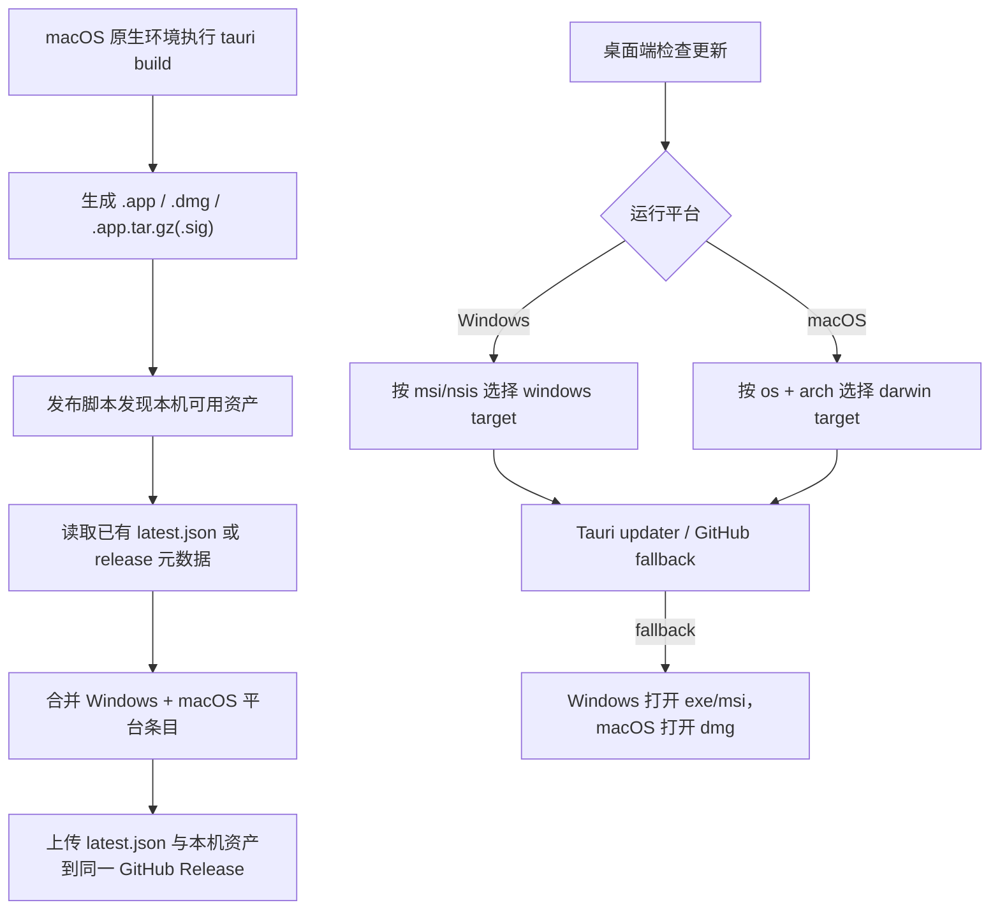

# macOS Distribution Support Design

## 0. 术语约定

- **macOS 构建环境**：指本地 Mac 或 `macos-latest` 这类原生 macOS runner。它不是“远程上传目标”，而是实际执行 `tauri build` 的运行环境。
- **手动安装包**：给用户从 GitHub Release 页面手动下载并安装的 macOS 资产，主形态是 `.dmg`。
- **updater 资产**：给 Tauri updater 消费的 macOS 更新包，主形态是 `.app.tar.gz` 及其 `.sig`，不是 `.dmg`。
- **平台目标**：`latest.json` 里用于区分不同 OS/架构/安装渠道的 key。现状只有 `windows-x86_64-msi` 和 `windows-x86_64-nsis`，本 feature 需要补入 `darwin-*`。
- **manifest 合并**：当 Windows 和 macOS 在不同机器上分开构建时，发布脚本不能用“本机资产覆盖整个 latest.json”，而要保留已经存在的其他平台 entries。

## 1. 决策与约束

**需求摘要**：让 PixAI 不再停留在“代码理论上可跨平台”，而是具备清晰的 macOS 构建和分发路径。成功标准是：在 macOS 原生环境中能产出 `.app` / `.dmg` / updater 资产；应用内更新在 macOS 上不再因为“未知安装器类型”直接失败；正式发布脚本可把 macOS 平台条目并入同一个 GitHub Release `latest.json`，且不破坏已存在的 Windows 条目。

**明确不做**：

- 不扩展 Linux 构建与分发。
- 不接入 Mac App Store 渠道。
- 不在本 feature 内申请或管理 Apple Developer 账号权限。
- 不在 Windows 环境模拟真实 macOS 签名 / notarization。
- 不顺手重写现有 Windows 发布链的整体结构。

**复杂度档位**：

- 健壮性 = L3 严防（发布脚本和 updater 目标选择都在生产边界上，失败必须可解释且不能误发错误资产）。
- 结构 = modules（会同时改前端更新逻辑、Rust 平台信息和 Node 发布脚本，不能堆在单一文件里）。
- 安全性 = validated（签名、公钥、发布源都属于受控输入；不能因为平台扩展把校验降级）。
- 兼容性 = backward-compatible（macOS 支持必须在不破坏现有 Windows 运行时更新和正式 release 的前提下落地）。

**关键决策**：

1. macOS 构建必须在原生 macOS 环境执行。Windows 机器可以继续承担文档、tag、release 协调，但不能替代 `.app` / `.dmg` / `.app.tar.gz` 的真实构建。
2. 应用内更新的运行时识别模型从“只有 installerType”升级为“OS + arch + 可选 installerType”。Windows 仍靠 `msi/nsis` 细分，macOS 走 `darwin-x86_64` / `darwin-aarch64` 这类架构目标。
3. 手动安装资产和 updater 资产分离。macOS 手动下载优先 `.dmg`，Tauri updater 只消费 `.app.tar.gz` + `.sig`。
4. 发布脚本必须支持 manifest 合并。Windows 和 macOS 分机发布时，后一次发布不能抹掉前一次已经写入 `latest.json` 的平台项。
5. Apple 签名 / notarization 作为发布链的一部分保留挂载点，但实现要允许“先做 smoke build，再补正式凭证”。也就是说：无凭证时先打通可构建和脚本路径；有凭证时再接正式外部分发。

**前置依赖**：

- 一台可执行 `pnpm tauri build` 的 macOS 环境。
- 若要真实对外发版，需要 Apple 签名 / notarization 凭证；若只是先落实现，不要求本轮就具备。
- 现有 GitHub Release / `latest.json` 仍是唯一正式更新源，不能另起第二套源。

## 2. 名词与编排

### 2.1 名词层

**现状**：

- `src-tauri/tauri.conf.json` 已启用 `bundle.active` 且包含 `icons/icon.icns`，说明仓库已经具备 macOS bundle 的基础资源。
- `src-tauri/Cargo.toml` 里 `tauri-winrt-notification` 还是无条件依赖；`winreg` 已经被放在 `cfg(windows)` 下。现状会增加首次 macOS 编译的风险点。
- `src/lib/platform.ts` 只暴露 `getAppInstallerType()`；`src/services/app-update.ts` 只认识 `windows-x86_64-msi` 和 `windows-x86_64-nsis`，非 Windows 路径会在 `getUpdaterTarget()` 里直接抛错。
- `src-tauri/src/lib.rs` 的 `app_installer_type()` 在非 Windows 下固定返回 `unknown`，说明当前运行时名词模型不足以支撑 macOS updater target 选择。
- `scripts/release-updater.mjs` 和 `scripts/local-updater.mjs` 都只搜索 MSI / NSIS 资产，并只向 `latest.json` 写入两个 Windows 平台 key。
- `README.md` 的 updater 发布说明也只覆盖 Windows 产物和 Windows 验证路径。

**变化**：

- 新增桌面平台信息契约，至少覆盖：
  - OS：`windows | macos | linux | unknown`
  - 架构：`x86_64 | aarch64 | unknown`
  - 安装渠道：Windows 继续保留 `msi | nsis | unknown`，macOS 不再强行复用这套字段表达 updater target。
- `AppUpdateService` 的目标选择逻辑改为平台感知：
  - Windows：按 installerType 选 `windows-x86_64-msi/nsis`
  - macOS：按 OS + arch 选 `darwin-x86_64/darwin-aarch64`
  - GitHub fallback：按平台优先挑 `.dmg` 或 Windows 安装器
- 发布脚本抽出共享的“资产发现 / manifest 组装 / 平台 key 计算”能力，既支持 Windows，也支持 macOS 的 `.app.tar.gz` / `.sig` / `.dmg`。
- 正式发布与本地 updater 验证脚本都支持 macOS 资产，但正式 `latest.json` 需要保留跨平台条目。

**接口示例**：

```ts
type DesktopPlatformInfo = {
  os: 'windows' | 'macos' | 'linux' | 'unknown'
  arch: 'x86_64' | 'aarch64' | 'unknown'
  installerType: 'msi' | 'nsis' | 'unknown'
}
```

```ts
await pixaiApi.appUpdate.getVersionInfo()
// Windows -> { version: '0.0.9', platform: 'desktop', runtime: 'tauri', os: 'windows', arch: 'x86_64', installerType: 'nsis' }
// macOS  -> { version: '0.0.9', platform: 'desktop', runtime: 'tauri', os: 'macos', arch: 'aarch64', installerType: 'unknown' }
```

```json
{
  "version": "0.0.9",
  "platforms": {
    "windows-x86_64-nsis": {
      "url": "https://github.com/FingerCaster/PixAI-Tauri/releases/download/0.0.9/PixAI_0.0.9_x64-setup.exe",
      "signature": "..."
    },
    "darwin-aarch64": {
      "url": "https://github.com/FingerCaster/PixAI-Tauri/releases/download/0.0.9/PixAI.app.tar.gz",
      "signature": "..."
    }
  }
}
```

### 2.2 编排层



**现状**：

- 正式发布链是单机 Windows 视角：构建签名包、生成 `latest.json`、上传 MSI / NSIS 和 manifest。
- 运行时更新检查也是 Windows 假设：只有识别出 `msi/nsis` 才能继续。
- 本地 updater 验证只按 Windows 安装包生成 feed，不具备 macOS 路径。

**变化**：

- 构建流程拆成“按平台构建资产”和“跨平台合并 manifest”两段。这样 Windows 和 macOS 可以在不同机器上各自产出 bundle，再把平台条目并进同一个 release。
- 应用内更新从“安装器中心”改成“平台中心”。Windows 仍需 installerType；macOS 只要知道 OS/arch 就能走 updater。
- GitHub fallback 也从“只找 Windows 安装器”升级成“按当前平台选手动安装资产”。

**流程级约束**：

- 错误语义：没有 macOS 构建环境或缺少 Apple 凭证时，应在构建 / 发布步骤报出可执行提示；不能以“未知安装器类型”这种误导性错误体现。
- 幂等性：同一 tag 反复执行 publish 应保持 `--clobber` 语义；同平台重复上传只覆盖本平台资产，不破坏其他平台 manifest 条目。
- 顺序约束：同一个 tag 的跨平台发布要串行，不建议 Windows / macOS 同时抢写 `latest.json`。
- 可观测点：脚本输出必须明确展示“发现了哪些平台资产”“写入了哪些 platform key”“是否做了 manifest merge”。
- 扩展点：目标模型保留 `linux` / 其他架构占位，但本轮不实现对应发布资产。

### 2.3 挂载点清单

- Rust 依赖与平台命令：`src-tauri/Cargo.toml`、`src-tauri/src/lib.rs`
- 前端平台适配：`src/lib/platform.ts`
- 应用更新编排：`src/services/app-update.ts`
- 本地 updater 验证脚本：`scripts/local-updater.mjs`
- 正式 release 脚本：`scripts/release-updater.mjs`
- 发布说明与 runbook：`README.md`

### 2.4 推进策略

1. 脚本微重构：先抽出共享 updater 资产发现 / manifest 组装 helper，保持现有 Windows 行为不变。
   退出信号：Windows 现有 `updater:local:*` / `updater:release:*` 命令输出与资产结果不回归。
2. 平台契约：补齐桌面端 OS / arch 信息读取，解除“只有 installerType 才能检查更新”的硬编码假设。
   退出信号：Windows 仍能识别 `msi/nsis`，macOS 至少能返回 `os=macos` 与正确架构。
3. macOS 构建基线：在 macOS 环境完成 `.app` 与 `.dmg` smoke build，并收敛 Windows-only Rust 依赖。
   退出信号：`pnpm tauri build -- --bundles app` 与 `--bundles dmg` 至少有一条稳定通过；构建失败时已定位并收口平台依赖问题。
4. 更新路径：让 `AppUpdateService` 支持 darwin updater target 和 macOS 的 GitHub fallback 资产选择。
   退出信号：macOS 不再因 `unknown installer type` 直接失败；fallback 资产优先指向 `.dmg`。
5. 发布路径：本地 / 正式 updater 脚本支持 darwin 资产、manifest merge 和跨平台顺序化发布。
   退出信号：针对同一 tag，先发 Windows 再发 macOS 或反过来，都不会丢失另一侧平台条目。
6. 文档与验证：补齐 README 的 macOS 构建 / 发布 / updater 说明，并形成最小验证矩阵。
   退出信号：实现者只看 README + checklist 就能在 macOS 环境复现构建与发布演练。

### 2.5 结构健康度与微重构

##### 评估

- 文件级 — `scripts/release-updater.mjs`：已包含 key 管理、构建、manifest、上传多种职责；当前 Windows 平台常量、资产发现和 manifest 组装与本地脚本高度重复。
- 文件级 — `scripts/local-updater.mjs`：与正式脚本重复维护平台常量、资产搜索、签名读取和 manifest 结构；直接在两边各加一份 macOS 逻辑，后续很容易漂移。
- 文件级 — `src/services/app-update.ts`：当前 updater target、fallback 资产选择和错误语义全围绕 Windows installerType 设计，是本 feature 的核心编排改动点。
- 文件级 — `src-tauri/Cargo.toml` / `src-tauri/src/lib.rs`：现有平台分支已经存在，但桌面平台名词模型不完整。
- 目录级 — `scripts/`：目前是平铺目录，但文件数量不多，新增一个共享 helper 文件不会造成目录失控。

##### 结论：做微重构（拆文件）

本次建议先做一个最小微重构：把 updater 资产发现、platform key 计算、manifest merge 相关纯函数抽到共享 helper 模块中，再在 `local-updater.mjs` 和 `release-updater.mjs` 里复用。这样 macOS 逻辑只实现一次，Windows 与 macOS 的平台矩阵也更容易保持一致。

验证方式：

- 在不接入任何 macOS 新逻辑前，先保证 Windows 现有 `updater:release:build` / `publish` 和 `updater:local:build` / `publish` 行为不变。
- 微重构后的 helper 只承接纯函数和资产扫描，不提前改命令入口、参数格式或上传协议。

##### 超出范围的观察

- 如果后续真的接 GitHub Actions 多平台并行发布，可能还需要把“manifest merge + release upload”提升成独立 CI job。但这属于发布编排层扩展，不阻塞当前 macOS 支持实现。

## 3. 验收契约

**关键场景清单**：

- 输入 / 触发：在 macOS 原生环境执行 `pnpm tauri build -- --bundles app`。期望：能生成 `.app` bundle，且不再被 Windows-only 依赖阻塞。
- 输入 / 触发：在 macOS 原生环境执行 `pnpm tauri build -- --bundles dmg` 或等价正式构建。期望：能生成给用户手动安装的 `.dmg`，并能定位对应 updater 资产。
- 输入 / 触发：macOS 运行时执行“检查更新”。期望：不会再抛出“无法识别当前安装器类型”，而是按 darwin target 正常检查，或在源不可用时回退到正确的 `.dmg` 下载页。
- 输入 / 触发：先在 Windows 机器发布同一 tag 的 Windows 资产，再在 macOS 机器发布同一 tag 的 macOS 资产。期望：最终 `latest.json` 同时包含 Windows 与 macOS 条目。
- 输入 / 触发：Windows 现有客户端执行“检查更新”。期望：仍按既有 `msi/nsis` 路径工作，不因 macOS 支持而回归。
- 输入 / 触发：缺少 Apple 正式签名 / notarization 凭证。期望：未走到对应步骤前不影响 smoke build；进入正式外部分发步骤时给出明确缺失提示。

**明确不做的反向核对项**：

- 代码中不应把 macOS updater 继续伪装成 `msi/nsis`。
- 发布脚本不应因为在单一机器上执行，就把另一平台的 `latest.json` 条目覆盖掉。
- GitHub fallback 不应继续只选 Windows 安装器。
- 不应为了支持 macOS 去改动图片生成、会话、图库等无关业务流程。

## 4. 与项目级架构文档的关系

acceptance 阶段应刷新 `.codestable/architecture/ARCHITECTURE.md` 中的两块内容：

- **应用更新系统**：从 Windows installerType 驱动，升级为跨平台 OS / arch 感知的 updater 编排。
- **正式 / 本地 updater 发布工具**：从“只覆盖 Windows 资产”升级为“跨平台资产发现 + manifest merge + 分机发布”的现状说明。

如果实现过程中新增了共享脚本 helper，建议补一份 `architecture/release-multi-platform.md` 或同类子文档，把发布资产类型、manifest merge 约束和签名边界单独记下来。
